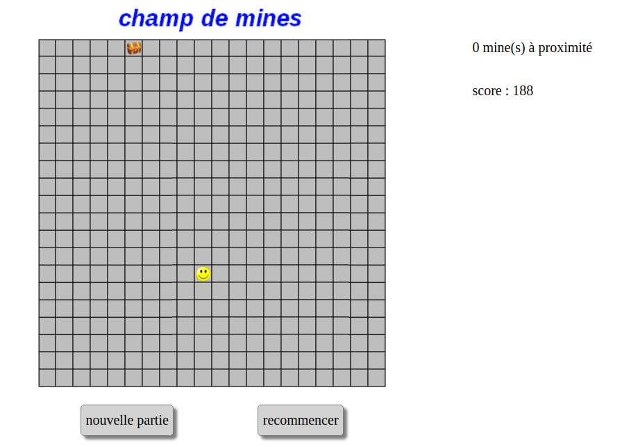
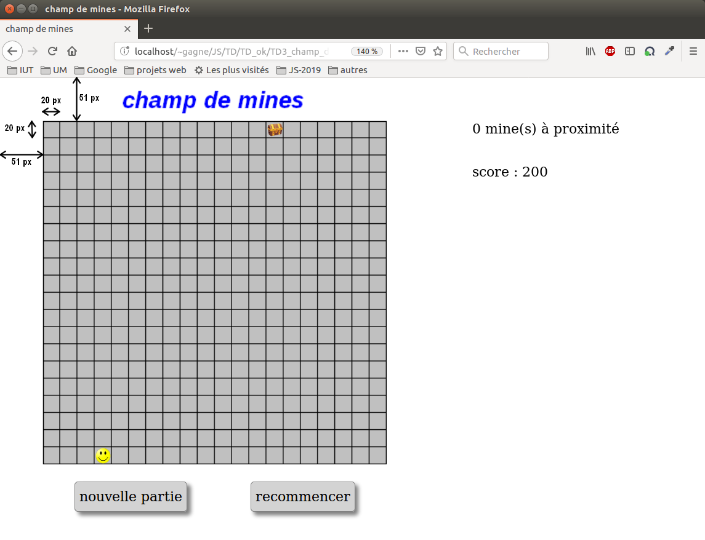

#  Prog web client riche - JavaScript 

### IUT Montpellier-Sète – Département Informatique

## TD3
#### _Thème : objets, classes, gestion d'événements par des écouteurs_

Cliquez sur le lien ci-dessous pour faire, dans un dossier public_html/JS/TD3, votre fork privé du TD3 (**attention, pas de fork à la main !**):

https://classroom.github.com/a/jziQocZu

la version [pdf](ressources/td3.pdf)

## INTRODUCTION

L’objectif de ce TD est de développer un jeu de champ de mines, où un personnage (représenté par un smiley) doit se déplacer sur un carré de 20 lignes et 20 colonnes pour atteindre un trésor (représenté par un coffre), en évitant un certain nombre de mines qui auront été déposées aléatoirement sur le terrain. 
Le personnage peut se déplacer avec les touches haut, bas, gauche et droite sur le terrain. Il ne peut pas en sortir.
Il est initialement placé sur une case aléatoire de la ligne du bas et le trésor est placé sur une case aléatoire de la ligne du haut. Il commence la partie avec un score de 200 points. Ce score est dégressif : chaque pas lui fait perdre un point.

A tout moment, il sera prévenu du nombre de mines qu’il a à proximité immédiate (à sa gauche, droite, devant ou derrière lui, mais pas celles placées en diagonale, inaccessibles en un pas).

   

S’il arrive au trésor, ou s’il marche sur une mine, un message donne l’information et le jeu est arrêté.

Vous utiliserez dans ce TD les objets JavaScript suivants :

- un objet Personnage, associé à la balise ``
- un objet Tresor, associé à la balise ``
- un objet Champ, associé à la balise `
` 

Les classes Personnage et Tresor héritent d’une classe `Element` qui regroupe les attributs et méthodes en commun.

Les fichiers `jeu.html` et `jeu.css` constituent une base de travail, ainsi que les images fournies. Vous testerez, dans la console, les méthodes que vous coderez.

## EXERCICE 1 - la classe Element

La classe `Element` aura deux classes filles : `Tresor` et `Personnage`. Il n’y aura donc pas d’objet `Element` proprement dit, mais un `Personnage` et un `Tresor`.

On définit un `Element` par les attributs suivants :

- `coordX`, nombre qui représente l’abscisse de l’élément dans le terrain. Partons du principe que la première colonne (la plus à gauche) correspond à `coordX = 1`, et la dernière colonne à `coordX = 20`.

- `coordY`, nombre qui représente l’ordonnée de l’élément. La ligne du haut (celle du trésor) correspondra à `coordY = 1` et la ligne du bas (d’où partira le personnage) correspondra à `coordY = 20`.

- `sprite`, qui correspond à la balise `html` liée à cet élément.

On prévoit les méthodes suivantes :

+ `constructor(x,y,id)`, qui construit un nouvel `Element`, de coordonnées `x` et `y`, et de `sprite` la balise `html` dont l’identifiant est le paramètre `id`.

+ `setSrc(str)`, qui met à jour le `src` du `sprite` en lui donnant la valeur du paramètre `str`.

+ `initialiser(x,y,str)`, qui donne aux attributs `coordX` et `coordY` les valeurs des paramètres `x` et `y`, puis agit aussi sur l’attribut `src` du `sprite` de l’`Element` en lui donnant la valeur du paramètre `str` par l’appel de `setSrc`, et enfin place l’`Element` (en appelant la méthode place décrite juste après).

+ `placer()`, qui positionne le `sprite` en ajustant son `top` et son `left` en fonction des coordonnées de l’Element. 
Il faudra donc modifier la valeur de `this.sprite.style.top` et de `this.sprite.style.left`. Le mode de calcul sera à mettre en place. Testez vos formules en console. Comme indications, chaque case de l’image de fond est un carré de 20 px de côté et le quadrillage est décalé de 51 px des bords de l’écran, comme indiqué ci-dessous. Les valeurs à attribuer à `this.sprite.style.top` et `this.sprite.style.left` seront donc construites à partir de `this.coordX`, `this.coordY`, et des nombres 51 et 20.

   

Codez cette classe Element en complétant le fichier `element.js`.

Vous savez qu’il n’y aura pas d’objet `Element` proprement dit, mais pour vérifier la justesse de votre code, vous pourrez en console tester les commandes suivantes :

        let T = new Element(5,1,'tresor');
        T.placer();
        let P = new Element(12,20,'personnage');
        P.placer();

## EXERCICE 2 - la classe Tresor

Un objet `Tresor` est un objet très simple. Il n’est pas amené à se déplacer. On prévoiera seulement comme méthodes :

+ `constructor(x)`, qui construit le trésor en invoquant le constructeur de la classe `Element`. Il n’y a besoin que d’un paramètre `x` (la colonne où sera déposé le trésor) puisque la ligne est obligatoirement celle du haut (ligne 1), et le paramètre `id` sera l’identifant de la balise qui sera naturellement associée au trésor.

+ `initialiser(x)`, qui invoque la méthode initialiser de la classe `Element`. A vous de trouver avec quels paramètres on invoque cette méthode.

Codez cette classe `Tresor` en complétant le fichier `tresor.js`. Testez les méthodes dans la console.

Remarques :
 
vous ferez appel au super-constructeur dans `constructor(x)` ;
vous ferez appel à la méthode mère `initialiser` de `Element` dans `initialiser(x)`.

Réactualisez la page, et testez votre code : 

        let T = new Tresor(5);
        T.placer();

## EXERCICE 3 - la classe Champ

Avant de coder la classe `Personnage`, qui hérite aussi de la classe `Element`, on va coder la classe `Champ` car `Personnage` utilise dans certaines de ses méthodes un objet `Champ`.

Un objet `Champ` a pour attributs un tableau nommé `carte`, et un autre attribut nommé `balise_div` qui correspondra à la balise `html` naturellement associée au champ de mines. Comme pour `Tresor` et `Personnage`, on aurait pu se passer de cet attribut en le dissociant de l’objet. C’est juste un autre point de vue.

Un objet `Champ` aura 3 méthodes :

+ `constructor(xP,xT,proba)`, qui prend plusieurs étapes :

	- créer `this.carte`, qui est un tableau matérialisant 20 lignes et 20 colonnes. Les paramètres `xP` et `xT` désignent les `coordX` initiales du personnage et du trésor. 

	On pourra considérer `this.carte` comme un tableau de 20 lignes, chacune des lignes étant un tableau de 20 cases. Chacune des 400 cases sera remplie soit avec un 0 soit avec un 1, en fonction du tirage d’un nombre aléatoire classique entre 0 et 1. 

	On pourra décider que si ce nombre aléatoire est inférieur au paramètre `proba`, alors on insère un 1 (= une mine) et sinon un 0 (= pas de mine). 

	N’oubliez pas la méthode push des tableaux en JavaScript. 

	- nettoyer un peu `this.carte`. Pour cela affectez de force 0 aux cases de `this.carte` correspondant aux proximités immédiates du trésor et du personnage. Le trésor ne doit pas être miné, ni sa proximité immédiate, ni celle de la position initiale du personnage.

	Remarque : RIEN ne garantit qu’il existe un chemin possible vers le trésor. La probabilité qu’au moins un chemin victorieux existe dépend bien sûr du paramètre `proba`, et on peut penser que plus `proba` est faible, plus cette probabilité d'avoir au moins un chemin vers le trésor est importante.

	- Affecter à `this.balise_div` la bonne balise `html`.

+ `afficher()`, qui a pour mission de remplir `this.balise_div` de 400 images dont la source est le fichier `img/croix.png`, et dont les `top` et `left` seront à calculer. Ces images auront soit la classe css `visible`, soit la classe css `cachee`. Ainsi, on verra s’afficher des croix partout où il y a une mine, et nulle part ailleurs.

+ `cacher()`, qui a pour mission de supprimer toutes les balises filles de `this.balise`, et donc potentiellement les 400 images crées par l’action de `afficher()`.

Codez cette classe `Champ` en complétant le fichier `champ.js`. Testez les méthodes dans la console. Cette classe possède 3 méthodes pas simples à coder, il faut être méticuleux.

Pour les méthodes `afficher()` et `cacher()`, vous pourrez utiliser :
	- `createElement`
	- `appendChild`
	- `removeChild`

Réactualisez la page, et testez votre code : 

        let C = new Champ(5,12,0.15);
        C.afficher();
        C.cacher();

## EXERCICE 4 - la classe Personnage

Un objet `Personnage` est plus complexe qu’un objet `Tresor`. Tout d’abord il a un attribut supplémentaire : son `score`, qui est au début de la partie fixé à 200. Ensuite, il a des méthodes liées à sa capacité de mouvement. Enfin, il a des méthodes liées au trésor et aux mines du champ. 

**Méthodes à prévoir :**

+ `constructor(x)`, qui construit le personnage en invoquant le constructeur de la classe `Element`. Il n’y a besoin que d’un paramètre `x` (la colonne où sera placé le personnage au début) puisque la ligne est obligatoirement celle du bas (ligne 20), et le paramètre name sera l’identifant de la balise qui sera naturellement associée au personnage. Même remarque que pour `Tresor` (super-constructeur).

+ `initialiser(x)`, qui invoque la méthode `initialiser` de la classe `Element`. A vous de trouver avec quels paramètres on invoque cette méthode. Il faudra aussi réinitialiser le `score` du personnage à 200. Ceci servira quand on recommence le même parcours après avoir perdu la partie. Même remarque que pour `Tresor` (`super.initialiser`).

+ `nbProxMines(C)`, qui retourne le nombre de mines à proximité du personnage `this`, mines qui sont répertoriées dans `C.carte`.

+ `indiquer_situation(C)`, qui calcule le nombre de mines à proximité de `this` en référence au champ de mines `C`, puis l’affiche dans la balise « affichage ». Cette méthode affiche aussi le `score` de `this` dans la balise « message ». Enfin, elle met à jour le `sprite` de `this` : si le nombre de mines à proximité est 0, c’est le sourire, sinon c’est la grimace.

+ `mouvement(dx,dy)`, qui ajoute (si c’est possible ! => à tester) `dx` à `coordX` et `dy` à `coordY`. Quand ces additions sont possibles, il faudra aussi placer le personnage, diminuer son score d’une unité.

+ `trouve(T)`, qui retourne un booléen disant si le personnage est arrivé au trésor `T` passé en paramètre.

+ `explose(C)`, qui retourne un booléen disant si le personnage a mis le pied sur une mine du champ `C` passé en paramètre.

Codez cette classe `Personnage` en complétant le fichier `personnage.js`. Testez les méthodes dans la console.

		let xT = 5;
		let xP = 12;
		let proba = 0.15;
		let T = new Tresor(xT);
		let P = new Personnage(xP);
		let C = new Champ(xP,xT,proba);
		T.placer();
		P.placer();
		C.afficher();
		P.mouvement(-1,0);
		P.actualiser_situation(C);
		etc

Dans le jeu, il y aura des variables globales P, T, C. On pourrait coder le jeu en utilisant, au coeur des méthodes, ces variables globales. On peut aussi adopter le point de vue de les passer en paramètres à des méthodes qui gèrent un Tresor, un Personnage ou un Champ de manière générique. C'est le point de vue adopté ici.

## EXERCICE 5 - le scénario du jeu

Il reste à coder le fichier `scenario.js`, qui va faire entrer en scène les divers objets, et organiser les gestions d’événements. Ce fichier possède déjà une fonction partiellement codée, et qui va gérer les événements clavier. 

### Les variables globales : 

- créez la variable `xP` qui est l’abscisse du futur personnage et initialisez-la à une valeur aléatoire entre 1 et 20 ;
- créez la variable `xT` qui est l’abscisse du futur trésor et initialisez-la à une valeur aléatoire entre 1 et 20 ;
- créez une variable `P` et initialisez-la par un appel au constructeur de `Personnage`, avec comme paramètre `xP` ;
- créez une variable `T` et initialisez-la par un appel au constrcuteur de `Tresor`, avec comme paramètre `xT` ;
- créez une variable `proba` et donnez-lui une valeur entre 0 et 1 qui vous semble raisonnable. Cette valeur correspond à la probabilité qu’a une case du champ de mines d’être minée. Au besoin, vous pourrez ajuster cette valeur par la suite.
- créez une variable `C` et initialisez-la par un appel au constructeur de `Champ`, avec comme paramètres les nombres `xP`, `xT` et `proba` ;
- sans modifier le code html, définissez l'attribut `onclick` de la balise dont l’identifiant est "rec" en lui donnant comme valeur la fonction `go` que nous allons décrire juste après :

### La fonction go :

Cette fonction sera appelée pour lancer le jeu, mais aussi à chaque fois qu’on cliquera sur le lien « recommencer ». 

il est possible que cela soit suite à une explosion, la carte des mines peut donc être affichée au moment où on clique sur le lien. Il faut donc coder la fonction `go` pour que :
 
- on commence par cacher cette carte ;
- on initialise `P` avec comme paramètre `xP`, et on le place ;
- on initialise `T` avec comme paramètre `xT`, et on le place ;
- on indique la situation de `P` ;
- enfin on met la page (le `<body>`) en écoute de l’événement `keydown`, avec comme fonction associée `gererClavier`.

### La fonction gererClavier :

Cette fonction prend un paramètre `event`, comme dans les exemples du cours. 

- complétez les `case` 37, 38, 39 et 40 qui représentent les 4 mouvements du personnage.
- pour la touche "a", c’est plus compliqué :
	+ on retire 50 au score de `P` ;
	+ on affiche la carte de `C` ;
	+ une seconde après on cache cette carte.
- puis on indique la nouvelle situation de `P` ;
- ensuite, il faut compléter ce qu’on doit faire si le personnage met le pied sur une mine :
	+ on retire l’écoute de l’événement `keydown` à `<body>`, pour bloquer la situation ;
	+ on affiche la carte des mines ;
	+ on met à l’affichage « perdu !!! ».
- enfin, il faut compléter ce qu’on doit faire si le personnage trouve le trésor :
	+ on retire l’écoute de l’événement `keydown` à `<body>`, pour bloquer la situation ;
	+ on met à l’affichage « gagné !!! ».

Et pour finir, après tout ce code, il reste à appeler la fonction `go` par l’instruction `go()` ;

Et c’est tout !!!

